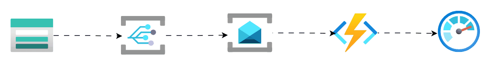

# Azure Claim Check Pattern Implementation

### Description
This project implements the **Claim Check** pattern to handle large payloads. Instead of sending heavy data via message bus, it stores the content in **Azure Blob Storage** and sends a reference (URI) to the consumer. This optimizes performance, reduces messaging costs, and bypasses provider size limits.

---

## 🛠 Infrastructure Components
The infrastructure is managed via **Terraform** and includes:
* **Azure Storage Account:** Persistent store for large message payloads.
* **Azure Service Bus:** Messaging queue for small pointers (claims).
* **Azure Event Grid:** System for reactive event-driven triggers.
* **Azure Functions:** Serverless processing logic (Python).
* **Azure Monitor:** Monitor infraestructure and custom metrics.

---

## 🏗 Technical Architecture
1. **Producer:** Uploads large data to Blob Storage and sends a small JSON message to Service Bus containing the Blob URI (the message is sent via Event Grid). Files are uploaded using the [Azure Storage Uploader](https://github.com/jonmunm/azure-storage_uploader/)
2. **Messaging:** Service Bus triggers the Azure Function upon receiving the claim.
3. **Consumer (Function):** Reads the URI, downloads the full payload from Storage, and executes the business logic. Send some metrics to Azure Monitor Custom Metrics API.



---

## 🚀 Getting Started

### 1. Prerequisites
* [Azure CLI](https://learn.microsoft.com/en-us/cli/azure/install-azure-cli)
* [Terraform](https://developer.hashicorp.com/terraform/downloads)
* [Azure Functions Core Tools](https://learn.microsoft.com/en-us/azure/azure-functions/functions-run-local)
* Python 3.9+

### 2. Clone the Repository
```bash
git clone https://github.com/jonmunm/azure-claim_check.git
cd azure_claim_check
```

### 3. Deploy Infrastructure (Terraform)

Provision the Azure resources. There are two important parameters:
* *deployment_id*: An ID to identify the deployed infrastructure
* *personal_principal_id*: Principal ID of your Azure user. Permissions granted to this user:
    * ```STORAGE BLOB DATA CONTRIBUTOR```: to upload files to the Storage Account and fire the orchestration
    * ```MONITORING METRICS PUBLISHER```: to optionally log the uploading process to Log Analytics

```bash
cd infra
terraform init
terraform plan
terraform apply --auto-approve --var="deployment_id=<ID>" --var="personal_principal_id=<ID>"
```

### 4. Local Development (Azure Functions)

* Create your ```src/local.settings.json``` file.
* Set up the Python environment (if needed):

```bash
cd ../src
python -m venv .venv
source .venv/bin/activate  # Windows: .venv\Scripts\activate
pip install -r requirements.txt
```

* Run the function:

```bash
func start
```

## 📖 Reference Documentation
1. [Microsoft: Claim-Check Pattern](https://learn.microsoft.com/en-us/azure/architecture/patterns/claim-check)
1. [Enterprise Integration Patterns: Claim Check](https://www.enterpriseintegrationpatterns.com/patterns/messaging/StoreInLibrary.html)